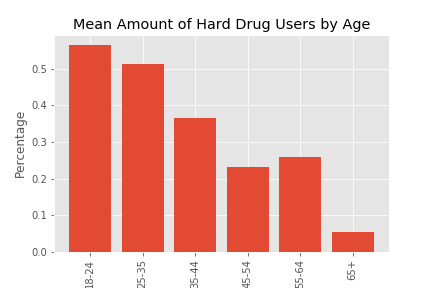
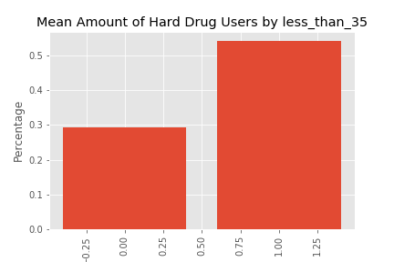
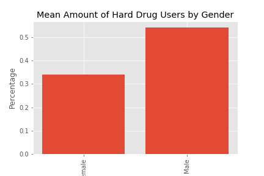

# Demographics, Personality Traits, and their Relationship Hard Drug Use

## <em>A model to corroberate and anticipate drug use</em>

Introduction to TBC after presentation.

# Data Sourcing:

All data for this investigation was provided by the University of California, Irvine's <em>Center for Machine Learning and Intelligent Systems.</em> For those following along at home, you can download this dataset at: https://archive.ics.uci.edu/ml/machine-learning-databases/00373/

# Data Cleaning, Feature Selection, and Feature Engineering:

Thankfully, this dataset is very clean, however, the labeling for categorization of some variables is not always the most user friendly. Rather than having the category labels at the options, they are labeled as standard diviations, which then leads to much back and from your notebook and the data dictionary in order to understand anything. Because of this, you will want to rename the categories for Age, Gender, Education, Country, and Ethnicity.

This dataset provies many options for targets one could investigate. In order to not have too narrow a focus, we decided to focus on people who were "users of hard drugs." The designation of a "user" was taken from the guidance of UC Irvine (that being someone who has used the drug in the past decade) and the designation of "hard drug" (crack, heroine, cocaine, and meth) was decided completely subjectively by what us without much debate. This is a proof of concept at best, and we were more interested in using our time to understand what we were building than using it to debate semantics. Should anyone ever want to use our models refined for a collection of drugs that they have put thought into currating, please contact us and let us know; we would be happy to make more thoughtful distinctions.

With our target defined and our categorical variables understandable, we first explored the relationships between the categorical variables and our target.

From our bar chart we could see that people in the age groups 18-24 and 25-34 were the most likely to do hard drugs.

As well, through Tukey's range test we could see that the average differences between these two groups were statistically significant from the other groups, however not from each other. Because of this, we combined the two groups to be the category "less_than_35" and tested it against the rest of our sample with a T test, establishing that it was, in fact, different.

Looking at hard drug users by gender there was a clear difference:

And a T test established that this difference was statistically significant.

We went though this process to see the relationship with each of our variables, however we did not find as strong and/or statistically significant relationships in any of the others.

# Dealing With Class Imbalance:

Because our classes were imbalanced by roughly a 60/40 split, we endevoured to balance them through a myriad of techniques. After trying up-sampling the minority class, down-sampling the majority class, creating synthetic minority observations (SMOTE), and using sklean's <em>class_weight='balanced'</em> option, we found the the most effective technique (based on the accuracy score of our training and testing sets) was to create Tomek links.

# Modeling:

We fit a wide variety of models in search of the best one. We explored **logistic regression** and despite spending much time tuning parameters using grid cross validation, surprisingly the default Logistic Regression parameters gave us the highest accuracy on our testing data.

We fit a **k Nearest Neighbor** model, but did not find it to be a good model to produce predictions.

A single **decision tree** also was not a strong model, however our **random forest** model tied as our highest scoring model. We also utilized grid cross validation, but decided not to use the parameters it provided after finding that they did not perform as well on our test data set as those that we came up with intuitively.

We implemented both **AdaBoost** as well as **XGBoost**, however these models did not perform as well as those that were unboosted.

Finally, to wrap everything up we put our models into a **voting classifier**. We even did grid cross validation to find the best weights for each model. While the results of this model were near the top, we ended up using our **Logistic Regression** model for our final because it has the added benefit of interpretability.

# Conclusion:

TBC after presentation
